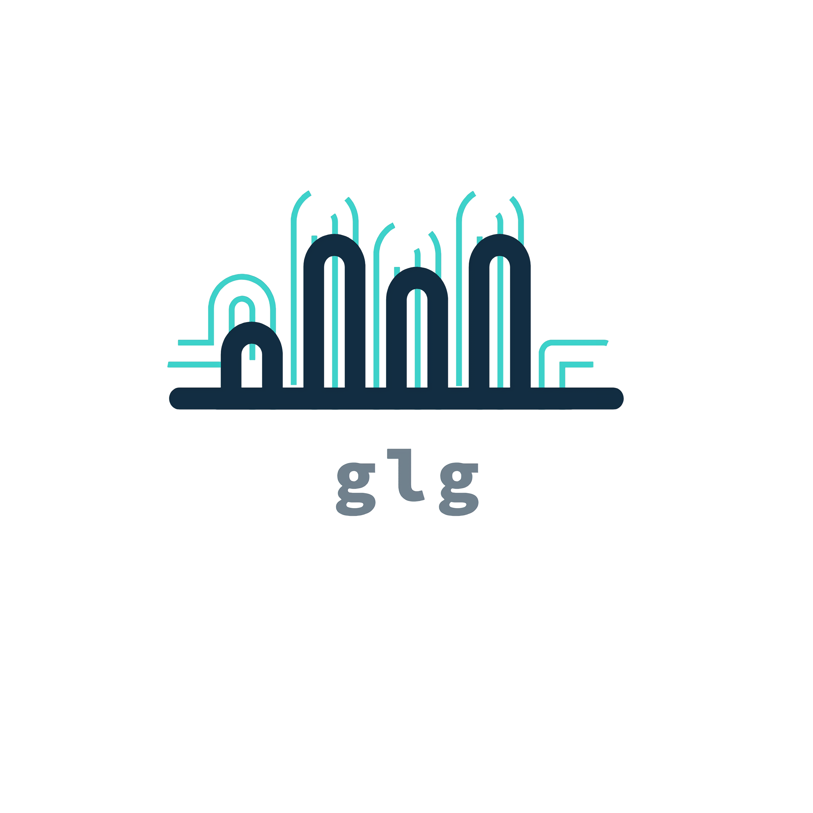
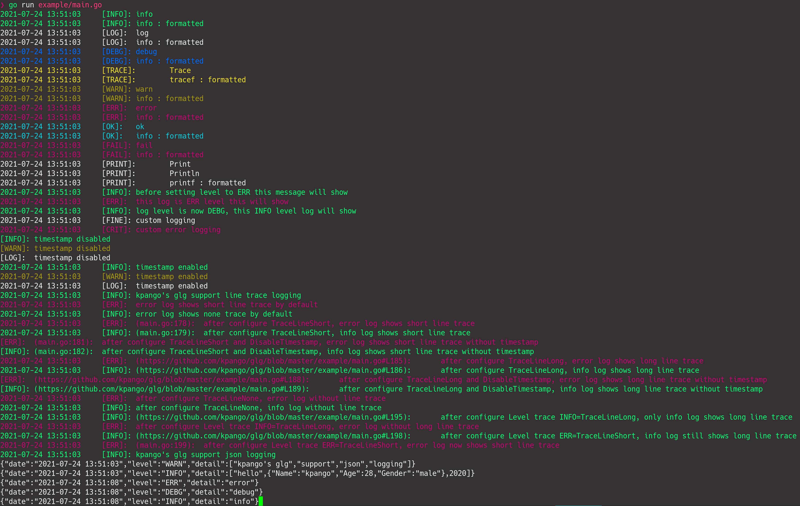
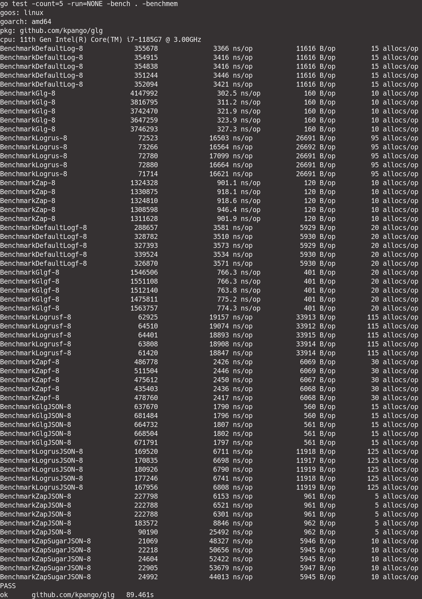

<div align="center">

</div>

[](https://opensource.org/licenses/MIT)
[](https://github.com/kpango/glg/releases/latest)
[](https://circleci.com/gh/kpango/glg)
[](https://codecov.io/gh/kpango/glg)
[](https://www.codacy.com/app/i.can.feel.gravity/glg?utm_source=github.com&amp;utm_medium=referral&amp;utm_content=kpango/glg&amp;utm_campaign=Badge_Grade)
[](https://goreportcard.com/report/github.com/kpango/glg)
[](https://golangci.com/r/github.com/kpango/glg)
[](https://gowalker.org/github.com/kpango/glg)
[](http://godoc.org/github.com/kpango/glg)
[](https://depshield.github.io)
[](https://app.fossa.io/projects/git%2Bgithub.com%2Fkpango%2Fglg?ref=badge_shield)


glg is simple golang logging library

## Requirement
Go 1.16

## Installation
```shell
go get github.com/kpango/glg
```

## Example
```go
package main

import (
	"net/http"
	"time"

	"github.com/kpango/glg"
)

// NetWorkLogger sample network logger
type NetWorkLogger struct{}

func (n NetWorkLogger) Write(b []byte) (int, error) {
	// http.Post("localhost:8080/log", "", bytes.NewReader(b))
	http.Get("http://127.0.0.1:8080/log")
	glg.Success("Requested")
	glg.Infof("RawString is %s", glg.RawString(b))
	return 1, nil
}

func main() {

	// var errWriter io.Writer
	// var customWriter io.Writer
	infolog := glg.FileWriter("/tmp/info.log", 0666)

	customTag := "FINE"
	customErrTag := "CRIT"

	errlog := glg.FileWriter("/tmp/error.log", 0666)
	defer infolog.Close()
	defer errlog.Close()

	glg.Get().
		SetMode(glg.BOTH). // default is STD
		// DisableColor().
		// SetMode(glg.NONE).
		// SetMode(glg.WRITER).
		// SetMode(glg.BOTH).
		// InitWriter().
		// AddWriter(customWriter).
		// SetWriter(customWriter).
		// AddLevelWriter(glg.LOG, customWriter).
		// AddLevelWriter(glg.INFO, customWriter).
		// AddLevelWriter(glg.WARN, customWriter).
		// AddLevelWriter(glg.ERR, customWriter).
		// SetLevelWriter(glg.LOG, customWriter).
		// SetLevelWriter(glg.INFO, customWriter).
		// SetLevelWriter(glg.WARN, customWriter).
		// SetLevelWriter(glg.ERR, customWriter).
		// EnableJSON().
		SetLineTraceMode(glg.TraceLineNone).
		AddLevelWriter(glg.INFO, infolog). // add info log file destination
		AddLevelWriter(glg.ERR, errlog).   // add error log file destination
		AddLevelWriter(glg.WARN, rotate)   // add error log file destination

	glg.Info("info")
	glg.Infof("%s : %s", "info", "formatted")
	glg.Log("log")
	glg.Logf("%s : %s", "info", "formatted")
	glg.Debug("debug")
	glg.Debugf("%s : %s", "info", "formatted")
	glg.Trace("Trace")
	glg.Tracef("%s : %s", "tracef", "formatted")
	glg.Warn("warn")
	glg.Warnf("%s : %s", "info", "formatted")
	glg.Error("error")
	glg.Errorf("%s : %s", "info", "formatted")
	glg.Success("ok")
	glg.Successf("%s : %s", "info", "formatted")
	glg.Fail("fail")
	glg.Failf("%s : %s", "info", "formatted")
	glg.Print("Print")
	glg.Println("Println")
	glg.Printf("%s : %s", "printf", "formatted")

	// set global log level to ERR level
	glg.Info("before setting level to ERR this message will show")
	glg.Get().SetLevel(glg.ERR)
	glg.Info("after setting level to ERR this message will not show")
	glg.Error("this log is ERR level this will show")
	glg.Get().SetLevel(glg.DEBG)
	glg.Info("log level is now DEBG, this INFO level log will show")

	glg.Get().
		AddStdLevel(customTag, glg.STD, false).                    // user custom log level
		AddErrLevel(customErrTag, glg.STD, true).                  // user custom error log level
		SetLevelColor(glg.TagStringToLevel(customTag), glg.Cyan).  // set color output to user custom level
		SetLevelColor(glg.TagStringToLevel(customErrTag), glg.Red) // set color output to user custom level
	glg.CustomLog(customTag, "custom logging")
	glg.CustomLog(customErrTag, "custom error logging")

	// glg.Info("kpango's glg supports disable timestamp for logging")
	glg.Get().DisableTimestamp()
	glg.Info("timestamp disabled")
	glg.Warn("timestamp disabled")
	glg.Log("timestamp disabled")
	glg.Get().EnableTimestamp()
	glg.Info("timestamp enabled")
	glg.Warn("timestamp enabled")
	glg.Log("timestamp enabled")

	glg.Info("kpango's glg support line trace logging")
	glg.Error("error log shows short line trace by default")
	glg.Info("error log shows none trace by default")
	glg.Get().SetLineTraceMode(glg.TraceLineShort)
	glg.Error("after configure TraceLineShort, error log shows short line trace")
	glg.Info("after configure TraceLineShort, info log shows short line trace")
	glg.Get().DisableTimestamp()
	glg.Error("after configure TraceLineShort and DisableTimestamp, error log shows short line trace without timestamp")
	glg.Info("after configure TraceLineShort and DisableTimestamp, info log shows short line trace without timestamp")
	glg.Get().EnableTimestamp()
	glg.Get().SetLineTraceMode(glg.TraceLineLong)
	glg.Error("after configure TraceLineLong, error log shows long line trace")
	glg.Info("after configure TraceLineLong, info log shows long line trace")
	glg.Get().DisableTimestamp()
	glg.Error("after configure TraceLineLong and DisableTimestamp, error log shows long line trace without timestamp")
	glg.Info("after configure TraceLineLong and DisableTimestamp, info log shows long line trace without timestamp")
	glg.Get().EnableTimestamp()
	glg.Get().SetLineTraceMode(glg.TraceLineNone)
	glg.Error("after configure TraceLineNone, error log without line trace")
	glg.Info("after configure TraceLineNone, info log without line trace")
	glg.Get().SetLevelLineTraceMode(glg.INFO, glg.TraceLineLong)
	glg.Info("after configure Level trace INFO=TraceLineLong, only info log shows long line trace")
	glg.Error("after configure Level trace INFO=TraceLineLong, error log without long line trace")
	glg.Get().SetLevelLineTraceMode(glg.ERR, glg.TraceLineShort)
	glg.Info("after configure Level trace ERR=TraceLineShort, info log still shows long line trace")
	glg.Error("after configure Level trace ERR=TraceLineShort, error log now shows short line trace")
	glg.Get().SetLineTraceMode(glg.TraceLineNone)

	glg.Info("kpango's glg support json logging")
	glg.Get().EnableJSON()
	err := glg.Warn("kpango's glg", "support", "json", "logging")
	if err != nil {
		glg.Get().DisableJSON()
		glg.Error(err)
		glg.Get().EnableJSON()
	}
	err = glg.Info("hello", struct {
		Name   string
		Age    int
		Gender string
	}{
		Name:   "kpango",
		Age:    28,
		Gender: "male",
	}, 2020)
	if err != nil {
		glg.Get().DisableJSON()
		glg.Error(err)
		glg.Get().EnableJSON()
	}	glg.CustomLog(customTag, "custom logging")

	glg.CustomLog(customErrTag, "custom error logging")

	glg.Get().AddLevelWriter(glg.DEBG, NetWorkLogger{}) // add info log file destination

	http.Handle("/glg", glg.HTTPLoggerFunc("glg sample", func(w http.ResponseWriter, r *http.Request) {
		glg.New().
		AddLevelWriter(glg.Info, NetWorkLogger{}).
		AddLevelWriter(glg.Info, w).
		Info("glg HTTP server logger sample")
	}))

	http.ListenAndServe("port", nil)

	// fatal logging
	glg.Fatalln("fatal")
}
```

<div align="center">

</div>

## Benchmarks

<div align="center">

</div>

## Contribution
1. Fork it ( https://github.com/kpango/glg/fork )
2. Create your feature branch (git checkout -b my-new-feature)
3. Commit your changes (git commit -am 'Add some feature')
4. Push to the branch (git push origin my-new-feature)
5. Create new Pull Request

## Author
[kpango](https://github.com/kpango)

## LICENSE
glg released under MIT license, refer [LICENSE](https://github.com/kpango/glg/blob/master/LICENSE) file.  
[](https://app.fossa.io/projects/git%2Bgithub.com%2Fkpango%2Fglg?ref=badge_large)
